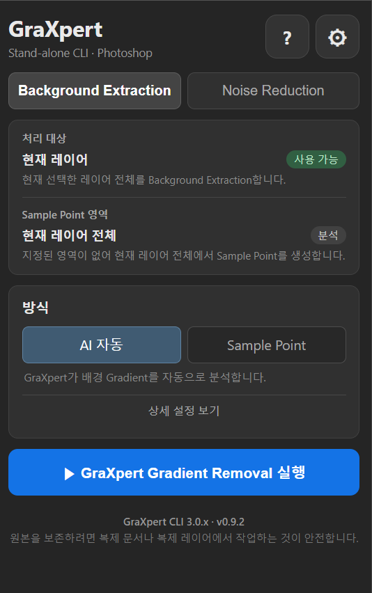
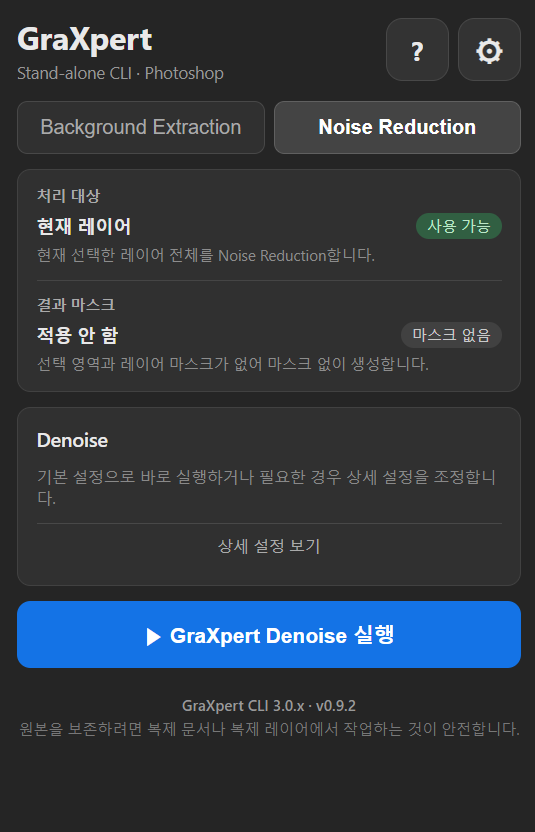
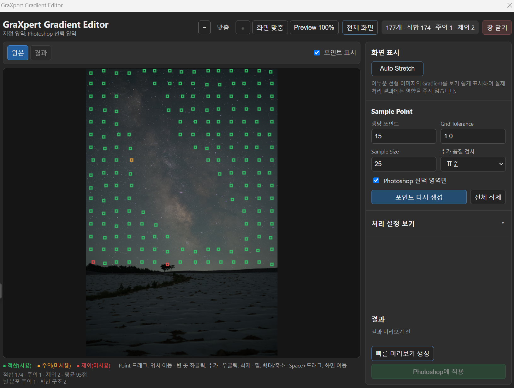

# GraXpert Photoshop Panel

GraXpert stand-alone CLI를 Adobe Photoshop에서 실행하고, 처리 결과를 원본 문서의 새 레이어로 가져오는 Windows용 CEP 패널입니다.

현재 버전: **v0.9.2** · 지원 CLI: **GraXpert CLI 3.0.x**

> 원본 픽셀 레이어는 직접 변경하지 않습니다. 결과는 처리 시작 시 선택한 레이어 바로 위에 새 레이어로 추가됩니다.

## 비공식 프로젝트 안내

이 프로젝트는 사용자가 독립적으로 개발한 비공식 서드파티 Photoshop 패널입니다. GraXpert 프로젝트 및 Adobe와 공식적인 제휴, 승인, 보증 관계가 없습니다.

이 저장소와 배포 패키지에는 GraXpert 실행 파일이 포함되지 않습니다. 사용자는 GraXpert를 별도로 설치해야 하며, GraXpert와 Adobe Photoshop의 사용 조건 및 라이선스를 각각 준수해야 합니다. GraXpert와 Adobe Photoshop을 비롯한 제품명 및 상표는 각 권리자에게 귀속됩니다.

## 화면

### 메인 패널

| Background Extraction | Noise Reduction |
|:---:|:---:|
|  |  |

### Gradient Editor



## 주요 기능

### Background Extraction

- GraXpert AI 자동 방식
- RBF, Splines, Kriging 기반 Sample Point 방식
- Photoshop 선택 영역 또는 현재 레이어 마스크를 Sample Point 분석 범위로 사용
- 독립 Gradient Editor에서 Point 추가, 삭제 및 이동
- Gradient Editor 전체 화면 전환과 Esc 원래 크기 복원
- 자동 Grid 생성과 Point 품질 검사
- 원본과 결과에 동일한 기준을 적용하는 Auto Stretch 미리보기
- 전체 해상도 원본/결과 비교 후 Photoshop 적용
- Background Model을 선택적으로 숨김 레이어로 추가

Background Extraction에서 지정 영역은 **Sample Point 분석에만 사용**되며 결과 레이어 마스크를 만들지 않습니다.

### Noise Reduction

- GraXpert Denoise 실행
- Denoise Strength 조절
- GPU Batch Size 조절
- Photoshop 선택 영역 또는 현재 레이어 마스크를 결과 레이어 마스크로 적용
- 처리 시작 시 선택했던 레이어 바로 위에 결과 배치

### 이번 배포에서 제외된 기능

Color Calibration 코드는 후속 개발을 위해 유지하지만, v0.9.2 사용자 화면에서는 숨겨져 있습니다.

## 요구 사항

- Windows
- Adobe Photoshop CEP Legacy Extension 지원 버전
- GraXpert CLI 3.0.x
- RGB Photoshop 문서

GraXpert의 기본 설치 위치는 다음과 같습니다.

```text
%LOCALAPPDATA%\Programs\GraXpert\GraXpert.exe
```

패널은 위 경로를 자동으로 확인합니다. 파일이 없으면 PATH에 등록된 `GraXpert.exe` 또는 설정에서 사용자가 선택한 경로를 사용합니다.

## 설치

1. GraXpert를 설치합니다.
2. Photoshop을 완전히 종료합니다.
3. 저장소 또는 배포 ZIP의 압축을 풉니다.
4. `Install_Windows.bat`를 실행합니다.
5. 설치 결과가 모두 `[OK]`인지 확인합니다.
6. Photoshop을 다시 실행합니다.
7. `Window > Extensions (Legacy) > GraXpert`를 엽니다.

설치 위치:

```text
%APPDATA%\Adobe\CEP\extensions\GraXpert-Photoshop-Panel
```

설치 상태를 확인하려면 Photoshop을 종료하고 `Diagnose_Install.bat`를 실행하세요.

## 빠른 사용법

### AI Background Extraction

1. 처리할 레이어를 선택합니다.
2. `Background Extraction` 탭에서 `AI 자동`을 선택합니다.
3. 필요한 경우 상세 설정을 조정합니다.
4. 아래쪽 실행 버튼을 누릅니다.

### Sample Point Background Extraction

1. `Sample Point` 방식을 선택합니다.
2. `자동 생성` 또는 `Gradient Editor 열기`를 누릅니다.
3. 천체 구조 위의 Point를 삭제하거나 실제 배경 위치로 이동합니다.
4. `빠른 미리보기 생성`으로 축소 Preview 결과를 원본과 비교합니다.
5. 결과가 적절하면 `Photoshop에 적용`을 눌러 전체 해상도 결과를 생성합니다.

### Noise Reduction

1. 처리할 레이어를 선택합니다.
2. `Noise Reduction` 탭을 엽니다.
3. 기본 Strength `0.50`으로 시작합니다.
4. GPU 메모리가 부족하면 Batch Size를 `2` 또는 `1`로 낮춥니다.
5. 실행 버튼을 누릅니다.

## 문서

- [한국어 사용자 설명서](USER_GUIDE_KO.txt)
- [상세 기능 및 개발 문서](README_KO.txt)

## 테스트

Node 자동 테스트:

```powershell
node tests\run-tests.js
```

Photoshop 통합 테스트:

```powershell
powershell -NoProfile -ExecutionPolicy Bypass -File .\tests\Run_Photoshop_Integration.ps1
```

통합 테스트는 임시 Photoshop 문서를 생성하여 TIFF 왕복, 결과 레이어 배치, 선택 영역과 레이어 마스크 처리를 확인합니다.

## 제거

Photoshop을 완전히 종료한 뒤 `Uninstall_Windows.bat`를 실행합니다.

다른 서명되지 않은 CEP 확장을 사용하지 않고 PlayerDebugMode까지 제거하려면 다음 명령을 사용합니다.

```powershell
Uninstall_Windows.bat /remove-debug
```

## 라이선스

이 프로젝트는 [GNU General Public License v3.0](LICENSE)에 따라 배포됩니다.

Copyright (C) 2026 drmedia
